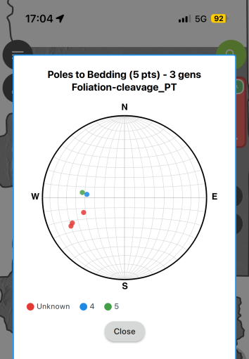

# QField Stereonet Plugin

A structural geology stereonet plugin for QField that plots orientation data on a Schmidt (equal-area) projection.
   
## Features

- **Schmidt net** with proper Lambert azimuthal equal-area projection
- **Poles to bedding** (circles) from Dip/Dip Direction fields
- **Lineations** (triangles) from Azimuth/Plunge fields
- **Planes as great circles** when both plane and lineation data exist
- **Generation coloring** for multi-phase structural data
- **View filtering** - plot only features in current map extent
- Automatic field name detection

## Installation

1. Upload from zip file via URL in Qfield App on your device in settings/plugins:
https://github.com/swaxi/stereonet/archive/refs/heads/main.zip    
23. Look for the 🌐 button in the toolbar

## Usage

| Action | Result |
|--------|--------|
| **Tap** | Plot stereonet |
| **Long press** | Toggle between all features (🌐 blue) and current view only (🔍 orange) |

## Plot Symbols

| Data | Symbol | When |
|------|--------|------|
| Poles to planes | ● Circle | Only dip/dip_dir fields present |
| Lineations | ▲ Triangle | Plunge/azimuth fields present |
| Planes | Great circle arc | Both plane and lineation fields present |

## Supported Fields

| Data Type | Field Names |
|-----------|-------------|
| Dip | `dip`, `dip_angle`, `dip_ref` |
| Dip Direction | `dip_dir`, `dip_direction`, `dipdir`, `dd`, `dipdir_ref` |
| Azimuth | `azimuth`, `az`, `bearing`, `trend` |
| Plunge | `plunge`, `pl` |
| Generation (optional) | `generation`, `gen`, `phase`, `event`, `set` |

## License

MIT
